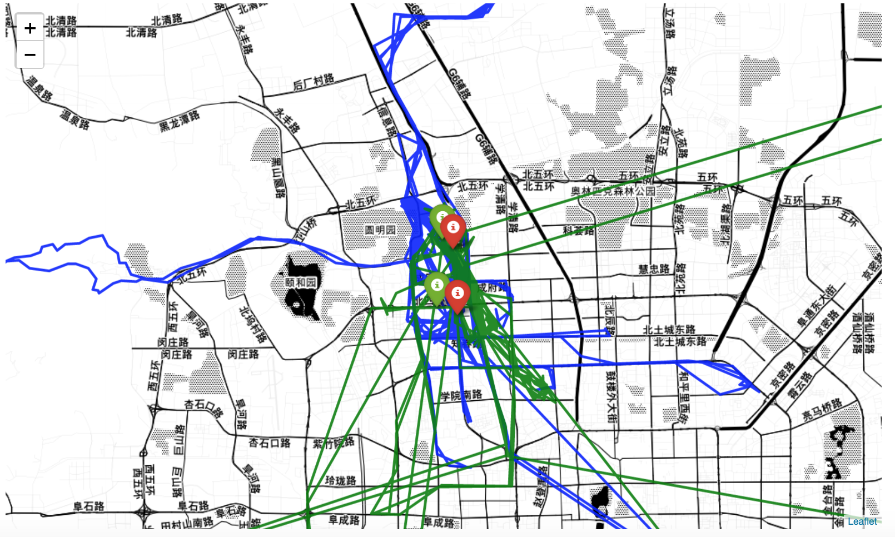

[](https://zenodo.org/badge/latestdoi/184337448)

# scikit-mobility - mobility analysis in Python


`scikit-mobility` is a library for human mobility analysis in Python. The library allows to: 

- represent trajectories and mobility flows with proper data structures, `TrajDataFrame` and `FlowDataFrame`. 

- manage and manipulate mobility data of various formats (call detail records, GPS data, data from Location Based Social Networks, survey data, etc.);

- extract human mobility metrics and patterns from data, both at individual and collective level (e.g., length of displacements, characteristic distance, origin-destination matrix, etc.)

- generate synthetic individual trajectories using standard mathematical models (random walk models, exploration and preferential return model, etc.)

- generate synthetic mobility flows using standard migration models (gravity model, radiation model, etc.)

- assess the privacy risk associated with a mobility dataset


## Documentation

https://scikit-mobility.github.io/scikit-mobility/


## Citing

if you use scikit-mobility please cite the following paper: https://arxiv.org/abs/1907.07062

```
@misc{pappalardo2019scikitmobility,
    title={scikit-mobility: a Python library for the analysis, generation and risk assessment of mobility data},
    author={Luca Pappalardo and Filippo Simini and Gianni Barlacchi and Roberto Pellungrini},
    year={2019},
    eprint={1907.07062},
    archivePrefix={arXiv},
    primaryClass={physics.soc-ph}
}
```


## Install

First, clone the repository - this creates a new directory `./scikit_mobility`. 

        git clone https://github.com/scikit-mobility/scikit-mobility scikit_mobility


### with conda - miniconda

1. Create an environment `skmob` and install pip

        conda create -n skmob pip python=3.7

2. Activate
    
        source activate skmob

3. Install skmob

        cd scikit_mobility
        python setup.py install

    If the installation of a required library fails, reinstall it with `conda install`.      

4. OPTIONAL to use `scikit-mobility` on the jupyter notebook

    - Install the kernel
    
          conda install ipykernel
          
    - Open a notebook and check if the kernel `skmob` is on the kernel list. If not, run the following:
    
          env=$(basename `echo $CONDA_PREFIX`)
          python -m ipykernel install --user --name "$env" --display-name "Python [conda env:"$env"]"

:exclamation: You may run into dependency issues if you try to import the package in Python. If so, try installing the following packages as followed.

```
conda install -n skmob pyproj urllib3 chardet markupsafe
```
          
### without conda (python >= 3.6 required)


1. Create an environment `skmob`

        python3 -m venv skmob

2. Activate
    
        source skmob/bin/activate

3. Install skmob

        cd scikit_mobility
        python setup.py install


4. OPTIONAL to use `scikit-mobility` on the jupyter notebook

	- Activate the virutalenv:
	
			source skmob/bin/activate
	
	- Install jupyter notebook:
		
			pip install jupyter 
	
	- Run jupyter notebook 			
			
			jupyter notebook
			
	- (Optional) install the kernel with a specific name
			
			ipython kernel install --user --name=skmob
			
          
### Test the installation

```
> source activate skmob
(skmob)> python
>>> import skmob
>>>
```

## Examples
### Create a `TrajDataFrame`

Create a `TrajDataFrame` from a list:

	>>> import skmob
	>>> # create a TrajDataFrame from a list
	>>> data_list = [[1, 39.984094, 116.319236, '2008-10-23 13:53:05'], [1, 39.984198, 116.319322, '2008-10-23 13:53:06'], [1, 39.984224, 116.319402, '2008-10-23 13:53:11'], [1, 39.984211, 116.319389, '2008-10-23 13:53:16']]
	>>> tdf = skmob.TrajDataFrame(data_list, latitude=1, longitude=2, datetime=3)
	>>> print(tdf.head())
	   0        lat         lng            datetime
	0  1  39.984094  116.319236 2008-10-23 13:53:05
	1  1  39.984198  116.319322 2008-10-23 13:53:06
	2  1  39.984224  116.319402 2008-10-23 13:53:11
	3  1  39.984211  116.319389 2008-10-23 13:53:16
	>>> print(type(tdf))
	<class 'skmob.core.trajectorydataframe.TrajDataFrame'>
	
Create a `TrajDataFrame` from a [pandas](https://pandas.pydata.org/) `DataFrame`:

	>>> import pandas as pd
	>>> # create a DataFrame from the previous list
	>>> data_df = pd.DataFrame(data_list, columns=['user', 'latitude', 'lng', 'hour'])
	>>> print(type(data_df))
	<class 'pandas.core.frame.DataFrame'>
	>>> # now create a TrajDataFrame from the pandas DataFrame
	>>> tdf = skmob.TrajDataFrame(data_df, latitude='latitude', datetime='hour', user_id='user')
	>>> print(type(tdf))
	<class 'skmob.core.trajectorydataframe.TrajDataFrame'>
	>>> print(tdf.head())
	   uid        lat         lng            datetime
	0    1  39.984094  116.319236 2008-10-23 13:53:05
	1    1  39.984198  116.319322 2008-10-23 13:53:06
	2    1  39.984224  116.319402 2008-10-23 13:53:11
	3    1  39.984211  116.319389 2008-10-23 13:53:16

Create a `TrajDataFrame` from a file:

	>>> # download the file from https://raw.githubusercontent.com/scikit-mobility/scikit-mobility/master/tutorial/data/geolife_sample.txt.gz
	>>> # read the trajectory data (GeoLife, Beijing, China)
	>>> tdf = skmob.TrajDataFrame.from_file('geolife_sample.txt.gz', latitude='lat', longitude='lon', user_id='user', datetime='datetime')
	>>> print(tdf.head())
		 lat         lng            datetime  uid
	0  39.984094  116.319236 2008-10-23 05:53:05    1
	1  39.984198  116.319322 2008-10-23 05:53:06    1
	2  39.984224  116.319402 2008-10-23 05:53:11    1
	3  39.984211  116.319389 2008-10-23 05:53:16    1
	4  39.984217  116.319422 2008-10-23 05:53:21    1
	
Plot the trajectory:

	>>> tdf.plot_trajectory(zoom=12, weight=3, opacity=0.9, tiles='Stamen Toner')
	


### Create a `FlowDataFrame`: 
Create a spatial tessellation (a geopandas GeoDataFrame) from a file:
	
	>>> import skmob
	>>> import geopandas as gpd
	>>> # load a spatial tessellation
	>>> url_tess = 'https://raw.githubusercontent.com/scikit-mobility/scikit-mobility/master/tutorial/data/NY_counties_2011.geojson'
	>>> tessellation = gpd.read_file(url_tess).rename(columns={'tile_id': 'tile_ID'})
	>>> print(tessellation.head())
	  tile_ID  population                                           geometry
	0   36019       81716  POLYGON ((-74.006668 44.886017, -74.027389 44....
	1   36101       99145  POLYGON ((-77.099754 42.274215, -77.0996569999...
	2   36107       50872  POLYGON ((-76.25014899999999 42.296676, -76.24...
	3   36059     1346176  POLYGON ((-73.707662 40.727831, -73.700272 40....
	4   36011       79693  POLYGON ((-76.279067 42.785866, -76.2753479999...
	
Create a `FlowDataFrame` from a spatial tessellation and a file of flows:
	
	>>> # load real flows into a FlowDataFrame
	>>> # download the file with the real fluxes from: https://raw.githubusercontent.com/scikit-mobility/scikit-mobility/master/tutorial/data/NY_commuting_flows_2011.csv
	>>> fdf = skmob.FlowDataFrame.from_file("NY_commuting_flows_2011.csv",
                                        tessellation=tessellation,
                                        tile_id='tile_ID',
                                        sep=",")
	>>> print(fdf.head())
	     flow origin destination
	0  121606  36001       36001
	1       5  36001       36005
	2      29  36001       36007
	3      11  36001       36017
	4      30  36001       36019

Plot the flows:

	>>> fdf.plot_flows(flow_color='red')
	


Plot the spatial tessellation: 

	>>> fdf.plot_tessellation(popup_features=['tile_ID', 'population'])


